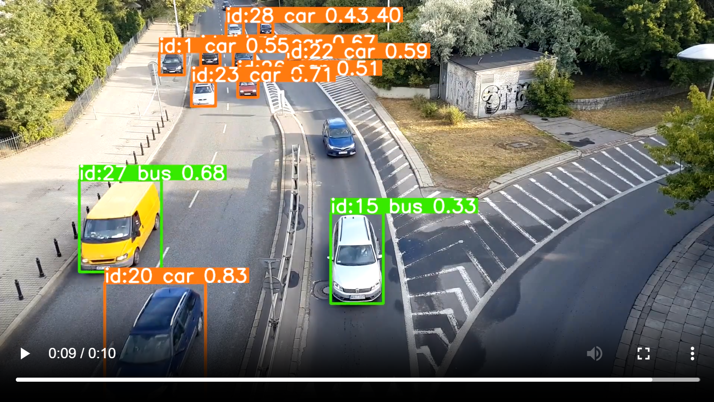

# Summary
*Video analytics* is an Object Tracking app built with [Ultralytics YOLOv8](https://docs.ultralytics.com/) and [Streamlit](https://streamlit.io/).

# Highlights


_Note_: the app uses an out-of-the-box [YOLOv8 detect](https://docs.ultralytics.com/de/models/yolov8) model, which has been pre-trained with the [COCO dataset](https://docs.ultralytics.com/datasets/detect/coco/). Whilst it provides a great starting point for object tracking, its precision is limited and the output may often indicate wrong classes.


# Running locally

```
pip install -r requirements.txt
streamlit run src/app.py
```

# Running locally with Docker

1. Build the docker image:
```
docker build -t video-analytics:latest .
```
(_Note_: the upstream Ultralytics image is quite large)

2. Run the app in a docker container:
```
docker run -p 8502:8502 video-analytics:latest
```

3. Browse to http://localhost:8502

# Development

## Managing dependencies

### CPU-only

The dependencies intented to be deployable should be CPU-only - most of GPU-enabled hosting options require extra charge. As the application uses a pre-trained YOLO model for predictions (object tracking), the CPU option is sufficient.

Direct dependencies are stored in `requirements-cpu.in`, which in turn are referenced by `pyproject.toml`.

To prepare the list of dependencies from scratch in your development environment, create a new conda or venv environment.

Then run:
```
pip install --no-cache -e ".[export]" --extra-index-url https://download.pytorch.org/whl/cpu

```
followed by:
```
pip freeze > requirements-cpu.txt
```